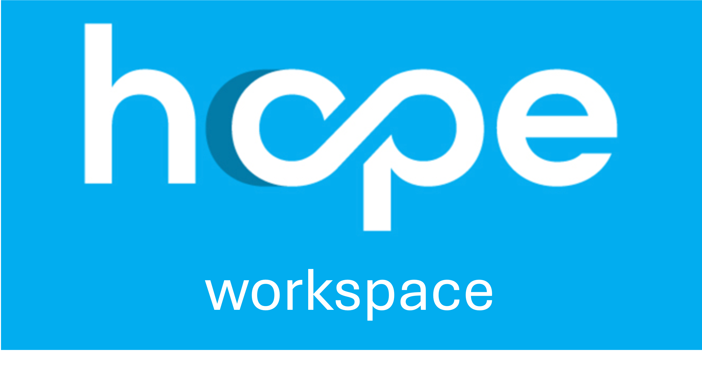

Hope Workspace is part of the  [UNICEF HOPE](https://github.com/unicef/hope) ecosystem and manages the data import and cleansing phase of the beneficiary
management process.

### Implemented Features

- Import data from Kobo / Aurora / XLS (RDI format)
- Data validation
- Data cleaning and updates
- Push data to HOPE
- Export/Amend/Import process
